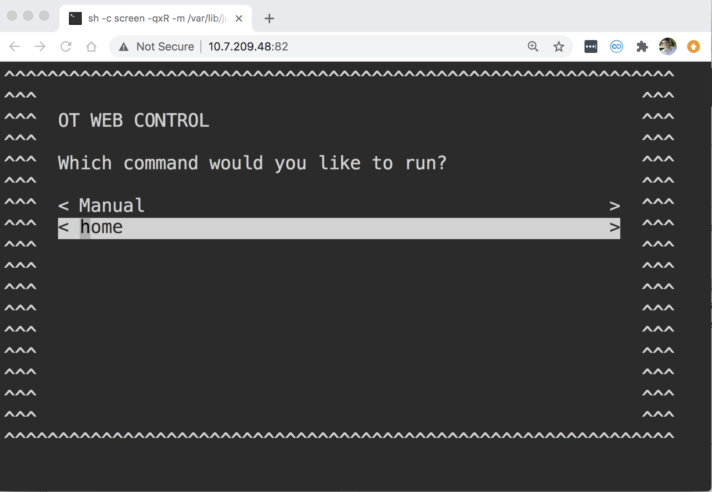

OT Web Control makes it easy to launch and interact with custom Python protocols from an OT2 robot. These protocols can input data from the user, and react dynamically.



## Installation


At the time of writing, to use this tool you have to opt in to the [Alpha](https://support.opentrons.com/en/articles/3854833-opentrons-beta-software-releases) channel of OpenTrons to update your robot to have `screen` and other development tools. This should change as soon as this version is released as a Stable version.

Launch the Jupyter notebook of the OT2. Go to New -> Terminal to get a terminal open.

Go to the notebooks directory:
```
cd /var/lib/jupyter/notebooks/
```

Clone this repository:
```
git clone https://github.com/theosanderson/OTWebControl
```

Copy the launcher script to the boot-up directory:
```
cp /var/lib/jupyter/notebooks/OTWebControl/startup  /data/boot.d/
```

Reboot:
```
reboot
```

## Usage

You should now be able to access a basic web server at `http://[YOUR ROBOT IP]`. If you click the Launch web control you should be presented with a menu of commands to run (this is hosted at `http://[YOUR ROBOT IP]:82`).

To add commands to this menu simply create python files in the `commands` directory. Anything you put in the `web` directory can be accessed at the web server.


